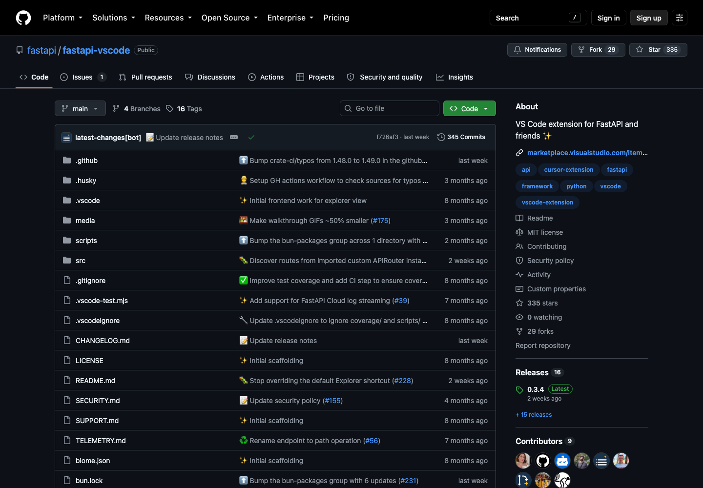
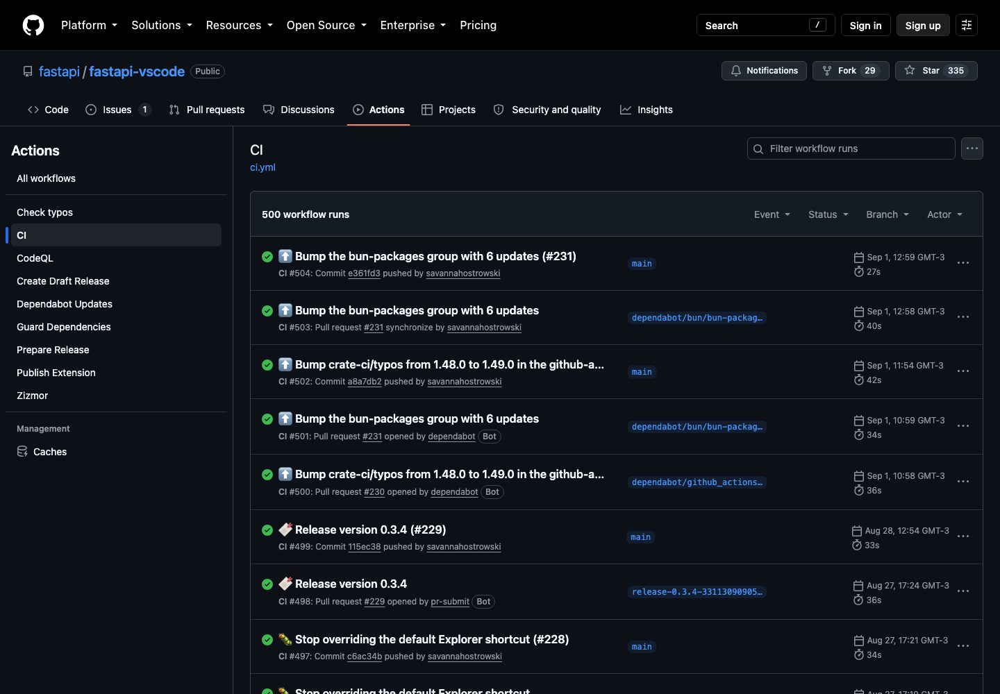
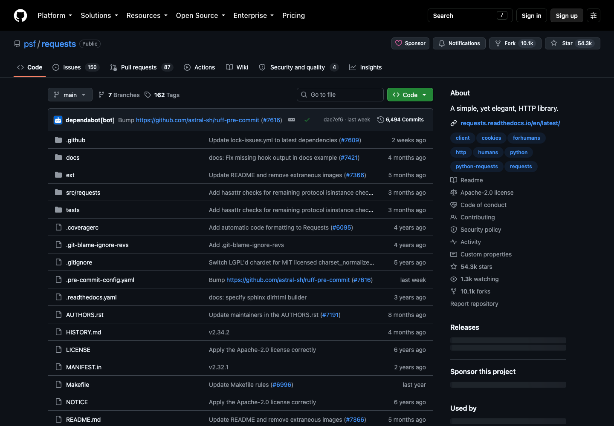
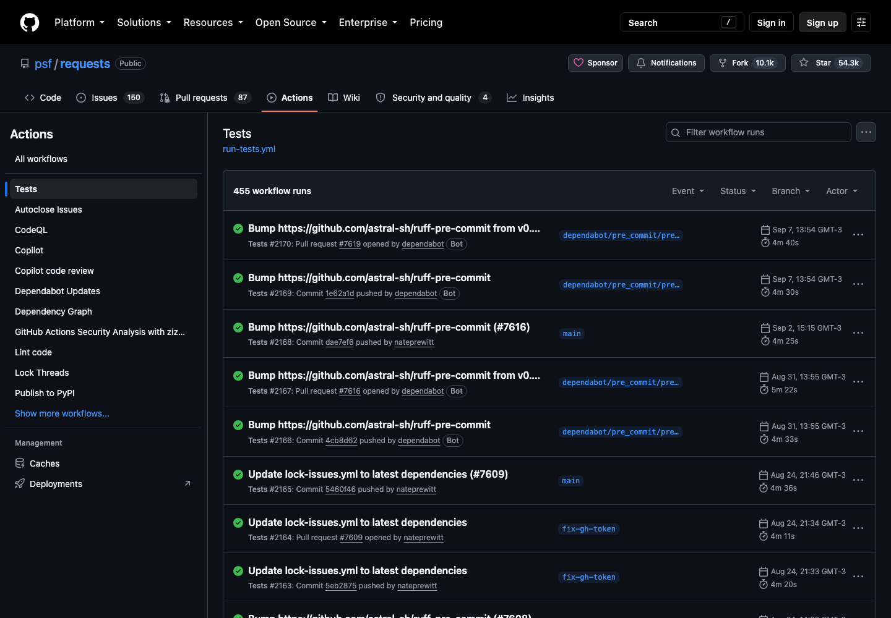
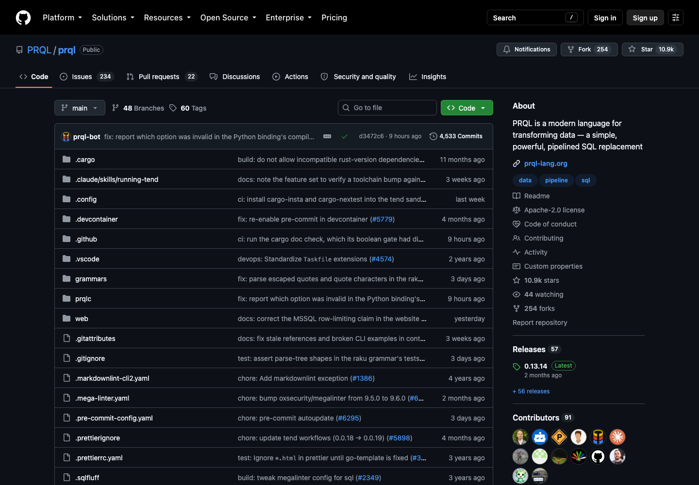
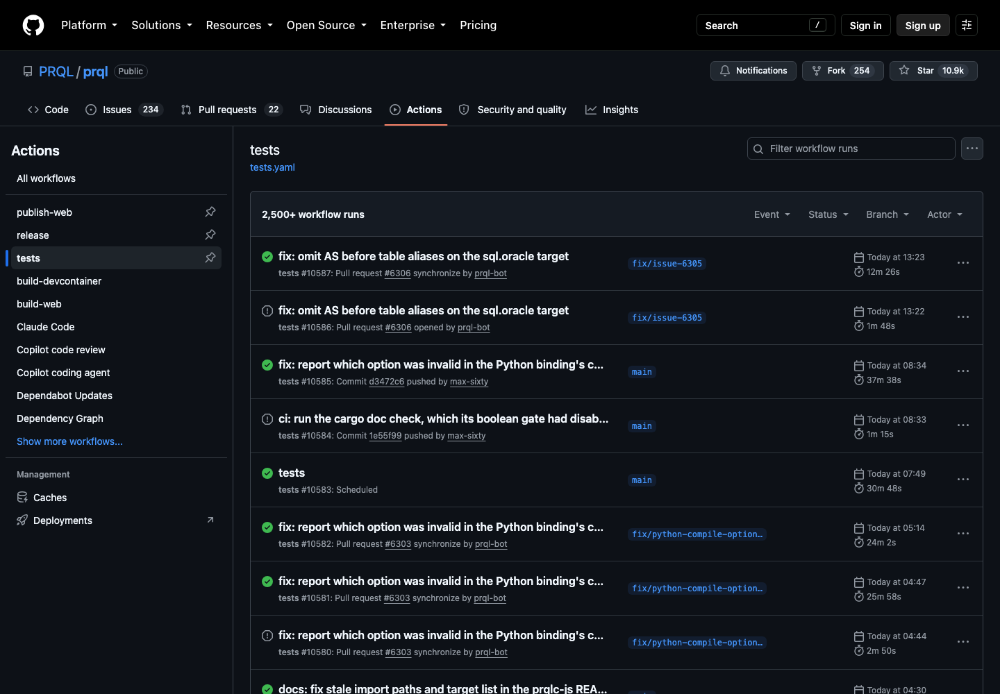

# Tarefa 06 — Integração e análise de pipelines com GitHub Actions

> **Aula:** 06
>
> **Prazo:** 19 de setembro de 2026, às 23h59
>
> **Status:** ✅ Concluída

[← Voltar ao README principal](../../README.md)

## 🎯 Objetivo

Integrar uma pipeline ao projeto utilizando o GitHub Actions, configurando sua execução automática sempre que um novo `push` for realizado na branch principal (`main`).

Além da implementação, a atividade propõe analisar pelo menos três repositórios públicos que utilizem pipelines, destacando suas características, funcionalidades, gatilhos e histórico de execução.

## 📋 Proposta da atividade

1. Integrar uma pipeline ao projeto com GitHub Actions.
2. Configurar o workflow para ser executado a cada `push` na branch `main`.
3. Executar e verificar o funcionamento das etapas automatizadas.
4. Buscar repositórios do GitHub que possuam integração de pipeline.
5. Selecionar e analisar pelo menos três repositórios.
6. Identificar características, funcionalidades, gatilhos e histórico de execução.
7. Documentar e comparar os resultados obtidos.

## 📖 Introdução

O GitHub Actions é uma ferramenta de automação integrada ao GitHub. Por meio dela, é possível criar workflows capazes de executar tarefas automaticamente em resposta a eventos ocorridos no repositório.

Esses workflows são definidos em arquivos YAML, normalmente armazenados no diretório:

```text
.github/workflows/
```

Eles podem automatizar processos como instalação de dependências, compilação, execução de testes, análise de código, geração de artefatos e publicação de novas versões.

Nesta atividade, além da implementação de uma pipeline no projeto da disciplina, foram analisados três repositórios públicos com diferentes níveis de complexidade:

1. [`fastapi/fastapi-vscode`](https://github.com/fastapi/fastapi-vscode);
2. [`psf/requests`](https://github.com/psf/requests);
3. [`PRQL/prql`](https://github.com/PRQL/prql).

## 1️⃣ Parte 1 — Pipeline do projeto

### Projeto escolhido

A pipeline foi integrada a este repositório, responsável por armazenar os conteúdos e as atividades da disciplina de Integração e Entrega Contínua. Como o projeto é composto principalmente por documentos Markdown e materiais em PDF, as etapas foram adaptadas para validar, empacotar e publicar a documentação.

### Arquivo e gatilhos do workflow

O workflow está definido em `.github/workflows/pipeline.yml`. Seu gatilho principal atende diretamente ao requisito da atividade:

```yaml
on:
  push:
    branches: [main]
```

Também foi incluído o gatilho `workflow_dispatch`, que permite iniciar uma execução manualmente pela aba **Actions**.

### Actions utilizadas

| Action | Função na pipeline |
| --- | --- |
| `actions/checkout@v7` | Baixa o conteúdo do repositório no ambiente de execução |
| `actions/upload-artifact@v7` | Armazena temporariamente a documentação e o pacote gerados |
| `actions/download-artifact@v8` | Recupera os artefatos em jobs posteriores |
| `peaceiris/actions-gh-pages@v4.1.0` | Publica a documentação na branch `gh-pages` |

### Etapas da pipeline

Os jobs foram conectados com a propriedade `needs`, formando um fluxo sequencial:

```text
Build → Test → Quality → Security → Package → Deploy
      → Smoke Test → Performance → Monitoring
```

| Etapa | Função |
| --- | --- |
| Build | Prepara o README, as atividades e os materiais para publicação |
| Test | Confere a quantidade de atividades e valida os links locais |
| Quality | Verifica títulos e o padrão de formatação dos arquivos Markdown |
| Security | Procura padrões conhecidos de credenciais expostas |
| Package | Gera e valida o arquivo `documentacao-devops.tar.gz` |
| Deploy | Publica a documentação na branch `gh-pages` |
| Smoke Test | Confere os arquivos essenciais da versão publicada |
| Performance | Valida se a documentação permanece abaixo de 50 MB |
| Monitoring | Confirma a existência da branch de publicação |

### Resultado da execução

Após o envio do workflow à `main`, o GitHub Actions iniciou a pipeline automaticamente. Todos os nove jobs foram concluídos com sucesso, comprovando o funcionamento do gatilho, das validações, do empacotamento e da publicação.

```text
Novo push em main → Validações → Empacotamento → Publicação → Verificações finais
```

- [Consultar execução bem-sucedida da pipeline](https://github.com/Isadora-Correa/Integracao-Entrega-Continua-DevOps/actions/runs/34526848374)

## 2️⃣ Parte 2 — Análise de repositórios

### Repositório 1 — FastAPI VS Code

#### Identificação

- **Repositório:** [`fastapi/fastapi-vscode`](https://github.com/fastapi/fastapi-vscode)
- **Workflow analisado:** [`.github/workflows/ci.yml`](https://github.com/fastapi/fastapi-vscode/blob/main/.github/workflows/ci.yml)
- **Nome do workflow:** `CI`



*Figura 1 — Página principal do repositório FastAPI VS Code no GitHub.*

#### Características e funcionalidades

O FastAPI VS Code é uma extensão do Visual Studio Code voltada ao ecossistema FastAPI. Seu workflow apresenta uma estrutura de Integração Contínua relativamente direta: existe um job principal chamado `ci`, executado em `ubuntu-latest`, que concentra diferentes verificações do projeto.

Primeiro, o código é obtido com `actions/checkout`. Em seguida, o Bun é configurado por meio da Action `oven-sh/setup-bun`. A pipeline então executa:

```text
bun ci
bun run lint
bun run typecheck
bun run test:scripts
bun run compile
xvfb-run -a bun run test:coverage
```

Esses comandos instalam as dependências, analisam a formatação e a qualidade do código, verificam tipos, testam scripts, compilam a extensão e executam testes com cobertura.

#### Gatilhos

O workflow utiliza dois gatilhos, ambos relacionados à branch `main`:

```yaml
on:
  push:
    branches: [main]
  pull_request:
    branches: [main]
```

Assim, a pipeline é executada tanto após um `push` na branch principal quanto na abertura ou atualização de um pull request direcionado a ela.

#### Histórico de execuções



*Figura 2 — Histórico de execuções do workflow CI do FastAPI VS Code.*

Na data da análise, a página apresentava **500 execuções** do workflow `CI`. O histórico exibe execuções originadas por commits e pull requests, além do status, da branch, do responsável e da duração de cada processo.

#### Análise

Apesar de possuir apenas um job principal, a pipeline reúne verificações importantes. Sua estrutura linear facilita a compreensão e permite detectar rapidamente problemas de lint, tipos, compilação ou testes. O gatilho de `push` na `main` também corresponde diretamente ao requisito da atividade.

### Repositório 2 — Requests

#### Identificação

- **Repositório:** [`psf/requests`](https://github.com/psf/requests)
- **Workflow analisado:** [`.github/workflows/run-tests.yml`](https://github.com/psf/requests/blob/main/.github/workflows/run-tests.yml)
- **Nome do workflow:** `Tests`



*Figura 3 — Página principal do repositório Requests no GitHub.*

#### Características e funcionalidades

Requests é uma biblioteca Python utilizada para realizar requisições HTTP. O principal diferencial do workflow analisado é a utilização de uma **matriz de execução (`matrix`)**.

Em vez de testar somente uma configuração, o GitHub Actions cria combinações entre diferentes versões do Python e três sistemas operacionais:

- Ubuntu 22.04;
- macOS;
- Windows.

Entre os ambientes de Python configurados estão versões estáveis, uma versão de desenvolvimento e PyPy. A pipeline realiza checkout, configura o Python, utiliza cache do `pip`, instala dependências e executa a suíte de testes.

Além do job principal, existem verificações específicas sem bibliotecas de detecção de caracteres e com uma versão anterior do `urllib3`. O repositório também possui outros workflows, incluindo um processo separado para publicação no PyPI.

#### Gatilhos

O workflow é iniciado por:

```yaml
on: [push, pull_request]
```

Ao contrário do primeiro projeto, o evento de `push` não está restrito diretamente à `main` no arquivo analisado. Qualquer push ou evento de pull request contemplado pelo GitHub pode iniciar os testes.

#### Histórico de execuções



*Figura 4 — Histórico de execuções do workflow Tests do Requests.*

No momento da análise, o workflow `Tests` apresentava **455 execuções**. As execuções exibidas possuem duração maior do que as observadas no FastAPI VS Code, resultado esperado pela quantidade de combinações criadas pela matriz.

#### Análise

A estratégia `matrix` amplia a cobertura dos testes e permite descobrir incompatibilidades que poderiam ocorrer somente em determinada versão do Python ou sistema operacional. Essa abordagem é especialmente importante para bibliotecas distribuídas a muitos usuários, que podem executar o software em ambientes diferentes.

### Repositório 3 — PRQL

#### Identificação

- **Repositório:** [`PRQL/prql`](https://github.com/PRQL/prql)
- **Workflow analisado:** [`.github/workflows/tests.yaml`](https://github.com/PRQL/prql/blob/main/.github/workflows/tests.yaml)
- **Nome do workflow:** `tests`



*Figura 5 — Página principal do repositório PRQL no GitHub.*

#### Características e funcionalidades

PRQL é uma linguagem moderna para transformação de dados. Entre os três projetos, seu workflow apresenta a arquitetura mais complexa.

A pipeline começa com um job chamado `rules`, que utiliza filtros para identificar os arquivos modificados e decidir quais verificações devem ser executadas. O projeto possui componentes em diferentes linguagens e ambientes, incluindo:

- Rust;
- JavaScript;
- Python;
- Java;
- .NET;
- PHP;
- Elixir;
- componentes web;
- documentação;
- contêineres.

O arquivo principal atua como um orquestrador. Ele aplica regras condicionais e chama workflows reutilizáveis especializados, evitando a execução desnecessária de todos os testes quando somente uma parte do projeto foi alterada.

Também existem matrizes para testar componentes em Ubuntu, Windows e macOS, além de verificações de documentação, links, cobertura e ambientes de desenvolvimento em contêineres.

#### Gatilhos

O workflow pode ser iniciado por cinco mecanismos:

| Gatilho | Função |
| --- | --- |
| `pull_request` | Executa em abertura, reabertura, atualização e adição de labels |
| `push` | Executa quando alterações são enviadas à branch `main` |
| `schedule` | Inicia automaticamente todos os dias pelo cron `49 10 * * *` |
| `workflow_dispatch` | Permite execução manual pela interface |
| `workflow_call` | Permite que o workflow seja chamado por outro workflow |

O projeto ainda utiliza `concurrency` com cancelamento de execuções anteriores do mesmo grupo, evitando o consumo de recursos com processos que se tornaram desatualizados após novas alterações.

#### Histórico de execuções



*Figura 6 — Histórico de execuções do workflow tests do PRQL.*

Na data da análise, o histórico indicava **mais de 2.500 execuções**. É possível observar processos originados por pull requests, pushes na `main` e execuções programadas. As diferenças de duração decorrem dos conjuntos de jobs escolhidos pelas regras de cada evento e alteração.

#### Análise

O PRQL demonstra uma aplicação avançada do GitHub Actions. Sua arquitetura combina vários gatilhos, execução condicional, matrizes e workflows reutilizáveis. Dessa maneira, o GitHub Actions deixa de ser apenas uma sequência de testes e passa a coordenar um sistema completo de integração e validação.

## ⚖️ Comparação entre os projetos

| Característica | FastAPI VS Code | Requests | PRQL |
| --- | --- | --- | --- |
| GitHub Actions | Sim | Sim | Sim |
| Push | Sim | Sim | Sim |
| Push específico na `main` | Sim | Não no workflow analisado | Sim |
| Pull request | Sim | Sim | Sim |
| Execução programada | Não | Não no workflow analisado | Sim |
| Execução manual | Não | Não no workflow analisado | Sim |
| Matriz | Não como elemento principal | Sim | Sim, em diferentes jobs |
| Múltiplos sistemas operacionais | Não | Sim | Sim |
| Testes automatizados | Sim | Sim | Sim |
| Verificação de código | Sim | Sim | Sim |
| Workflows reutilizáveis | Não como elemento principal | Não como elemento principal | Sim |
| Complexidade | Baixa/intermediária | Intermediária | Alta |

Os três projetos demonstram uma evolução de complexidade. O FastAPI VS Code apresenta uma pipeline direta e adequada à compreensão dos conceitos fundamentais. O Requests mostra como uma matriz amplia a cobertura dos testes em diversas plataformas e versões. O PRQL utiliza uma arquitetura sofisticada, formada por regras condicionais, múltiplos jobs, diferentes gatilhos e workflows reutilizáveis.

## 🔗 Relação com a pipeline da atividade

A pipeline deste repositório utiliza o mesmo princípio identificado no FastAPI VS Code e no PRQL: um `push` direcionado à branch `main` inicia automaticamente o workflow.

```text
Desenvolvedor → Commit → Push para main → GitHub Actions → Pipeline
```

O projeto da disciplina adota uma sequência linear de nove jobs, semelhante ao modelo mais direto do FastAPI VS Code. Ao mesmo tempo, utiliza artefatos e dependências entre jobs para separar responsabilidades e impedir que a publicação seja realizada quando uma validação anterior falha.

## ✅ Resultado

A atividade demonstrou que pipelines podem assumir diferentes níveis de complexidade conforme as necessidades do software. Uma configuração simples pode validar o projeto após cada `push`, enquanto projetos maiores podem testar diversos ambientes, selecionar dinamicamente os jobs necessários e reutilizar workflows especializados.

A pipeline integrada ao repositório da disciplina foi executada com sucesso e atende ao gatilho solicitado. A análise dos repositórios mostrou três estratégias relevantes:

- **FastAPI VS Code:** fluxo direto de lint, tipos, compilação e testes;
- **Requests:** matriz para compatibilidade entre versões do Python e sistemas operacionais;
- **PRQL:** orquestração avançada com condições, agendamento e workflows reutilizáveis.

Mais importante do que reproduzir a pipeline mais complexa é selecionar uma estrutura proporcional ao projeto, capaz de fornecer retorno rápido e confiável sem executar processos desnecessários.

## 🔗 Recursos

- [Workflow da Tarefa 06](../../.github/workflows/pipeline.yml)
- [Repositório da disciplina](https://github.com/Isadora-Correa/Integracao-Entrega-Continua-DevOps)
- [Material da Aula 06](<../Conteúdo/Aula 06 - Revisão Ferramentas e Pipelines.pdf>)
- [FastAPI VS Code](https://github.com/fastapi/fastapi-vscode)
- [Requests](https://github.com/psf/requests)
- [PRQL](https://github.com/PRQL/prql)

## 📅 Data da análise

As configurações e os históricos foram consultados em **10 de setembro de 2026**. Como os repositórios permanecem em desenvolvimento, os workflows e o número de execuções podem sofrer alterações posteriormente.

## 🧭 Navegação

[← Tarefa 05](../../Aula05/Tarefa05/Atividade05.md) · [README principal](../../README.md)
